# Tang138K_PCIeSGDMA_OV5640Up_HDMIOut

> 基于 Sipeed **Tang Mega 138K Pro**（高云 GW5AT-138K FPGA）与 **Orange Pi AI Pro**（昇腾 Atlas 200I A2，ARM64）的 OV5640 摄像头实时采集项目。
>
> 摄像头 DVP 输出 → FPGA 打包 → **PCIe SGDMA C2H** 搬运 → Host 环形缓冲 → SDL 实时显示。

- **分辨率/帧率**：1280×720 RGB565 @ **28.6 fps**（摄像头输出30fps）
- **版本**：FPGA `0x00000200` / Host `0x00000200`

---

## 目录

1. [硬件平台](#1-硬件平台)
2. [环境搭建](#2-环境搭建)
3. [系统架构](#3-系统架构)
4. [FPGA 代码详解](#4-fpga-代码详解)
5. [Host C++ 代码详解](#5-host-c-代码详解)
6. [构建与运行](#6-构建与运行)
7. [关键参数速查](#7-关键参数速查)
8. [开源许可](#8-开源许可)

---

## 1. 硬件平台

| 器件 | 型号 | 角色 |
|------|------|------|
| FPGA 开发板 | Sipeed Tang Mega 138K Pro（GW5AT-LV138PG484） | 摄像头采集 + SGDMA 搬运 |
| 摄像头模组 | OV5640（DVP 8bit 并行接口，模组自带 24MHz 晶振） | 图像源 |
| 上位机 | Orange Pi AI Pro（ARM64，内核 5.10，Ubuntu 22.04） | 接收 + 显示 |
| 互联 | PCIe Gen2 | 数据通道 |

> 摄像头通过 **DVP 8bit 并行口**（`cam_data[7:0]` + `cam_pclk/vsync/href`）接入 FPGA，配置走 **SCCB（I2C）** 接口。

---

## 2. 环境搭建

### 2.1 香橙派 AI Pro 1.2 板刷写 1.1 官方镜像

首次启动后建议执行：

```bash
sudo apt update && sudo apt upgrade -y
```

> 历史备注：刷完 1.1 镜像后若开机 HDMI 仍黑屏但 SSH 能通，多半是 `ascend_vdp_drm` 驱动加载时序问题，可手动加载：
>
> ```bash
> sudo insmod /var/davinci/driver/drv_osal.ko
> sudo insmod /var/davinci/driver/ascend_vdp_drm.ko
> ```

### 2.2 高云 Gowin IDE 的 Qt 依赖修复

Gowin IDE（V1.9.12.03 Linux 版）依赖 Qt5。直接把 1.2 板上的 IDE 目录拷贝到 1.1 系统后，运行会报共享库缺失：

```
error while loading shared libraries: libQt5Core.so.5:
cannot open shared object file: No such file or directory
```

**解决步骤**：

```bash
# 1. 看 IDE 主程序缺哪些依赖
ldd /path/to/Gowin/IDE/bin/gw_ide | grep "not found"

# 2. 安装缺失的 Qt5 运行库
sudo apt install -y \
    libqt5core5a libqt5gui5 libqt5widgets5 \
    libqt5network5 libqt5xml5 libqt5svg5 \
    libqt5dbus5 libqt5printsupport5 \
    libxcb-xinerama0 libxcb-icccm4 libxcb-image0 \
    libxcb-keysyms1 libxcb-randr0 libxcb-render-util0

# 3. 若 IDE 自带 Qt 库（IDE/lib 目录下有 libQt5*.so），
#    则不需要 apt 安装，直接让加载器指向 IDE 自带库：
export LD_LIBRARY_PATH=/path/to/Gowin/IDE/lib:$LD_LIBRARY_PATH

# 4. Qt 的 xcb 平台插件路径也要指对（否则报 "could not load platform plugin xcb"）
export QT_QPA_PLATFORM_PLUGIN_PATH=/path/to/Gowin/IDE/lib/platforms
```

把第 3、4 步的 `export` 写进 `~/.bashrc` 即可永久生效：

```bash
echo 'export LD_LIBRARY_PATH=/path/to/Gowin/IDE/lib:$LD_LIBRARY_PATH' >> ~/.bashrc
echo 'export QT_QPA_PLATFORM_PLUGIN_PATH=/path/to/Gowin/IDE/lib/platforms' >> ~/.bashrc
source ~/.bashrc
```

### 2.3 搜索并配置 FTDI 下载器驱动

Gowin 下载器基于 **FTDI FT2232H**（USB 转 JTAG），Linux 上需要正确识别并授权访问。

```bash
# 1. 确认 USB 设备被识别（VID 0403 = FTDI）
lsusb
# 应看到类似：Bus 001 Device 003: ID 0403:6010 Future Technology Devices International, Ltd FT2232H

# 2. 看内核是否已绑定驱动
dmesg | grep -i ftdi
lsmod | grep ftdi_sio

# 3. 安装 libusb（Gowin IDE 通过 libusb 访问下载器）
sudo apt install -y libusb-1.0-0-dev libftdi1 libftdi1-dev

# 4. 创建 udev 规则，给普通用户访问权限
sudo tee /etc/udev/rules.d/51-gowin-ftdi.rules << 'EOF'
SUBSYSTEM=="usb", ATTRS{idVendor}=="0403", ATTRS{idProduct}=="6010", MODE="0666"
SUBSYSTEM=="usb", ATTRS{idVendor}=="0403", ATTRS{idProduct}=="6014", MODE="0666"
EOF

sudo udevadm control --reload-rules
sudo udevadm trigger

# 5. 重新插拔下载器，确认设备节点出现
ls -l /dev/ttyUSB* /dev/bus/usb/*/* 2>/dev/null
```

配置完成后，Gowin IDE 的 Programmer 就能识别到下载器并烧录 bitstream。

### 2.4 更新 HDMI 显示库（SDL2 + KMSDRM 根治撕裂）

显示端最初用系统自带的 SDL 2.0.20 + X11 软件渲染，画面存在**撕裂**。根因是 X11 的 `present` 整帧拷贝非原子，与显示刷新不同步。

排查过程最终锁定 SDL 2.0.20 的 KMSDRM 后端存在 libudev 动态加载 bug（`undefined symbol _udev_device_get_action`），需要**自编译 SDL 2.28.5**：

```bash
# 1. 下载并编译 SDL 2.28.5
cd ~
wget https://www.libsdl.org/release/SDL2-2.28.5.tar.gz
tar xf SDL2-2.28.5.tar.gz
cd SDL2-2.28.5
./configure --enable-video-kmsdrm --enable-video-x11 --enable-libudev
make -j4
sudo make install          # 装到 /usr/local，不覆盖系统 /lib 的 2.0.20
sudo ldconfig
```

以 KMSDRM 直接输出（绕过 X11，走 DRM 硬件 vsync）运行：

```bash
sudo systemctl stop lightdm                # 释放 DRM master（桌面占用时必须停）
sudo mkdir -p /tmp/runtime-root
sudo SDL_VIDEODRIVER=KMSDRM XDG_RUNTIME_DIR=/tmp/runtime-root ./bin/video_gui -v
sudo systemctl start lightdm               # 跑完恢复桌面
```

> ✅ **结果**：KMSDRM 起来后 HDMI 直出 DRM page flip 硬件 vsync，**撕裂彻底消失**。采集/搬运链路一直零错位（BMP 逐帧检查无撕裂），撕裂 100% 是 X11 软件渲染 present 非原子导致的。

> 💡 如需回退到系统自带 SDL（卸载自编译的 2.28.5，作为备用恢复手段保存，**平时不必执行**）：
>
> ```bash
> sudo rm -f /usr/local/lib/libSDL2* /usr/local/lib/libSDL2main* /usr/local/bin/sdl2-config
> sudo rm -rf /usr/local/include/SDL2 /usr/local/lib/cmake/SDL2
> sudo rm -f /usr/local/lib/pkgconfig/sdl2.pc /usr/local/share/aclocal/sdl2.m4
> sudo ldconfig      # 系统自动回退用 /lib/aarch64-linux-gnu 的 SDL 2.0.20
> ```

`host/run.sh` 已把上述流程整合成一条龙，并按 SDL 版本自动选择显示后端：

| 检测条件 | 显示后端 |
|---------|---------|
| 物理显示器 + `/usr/local/lib/libSDL2-2.0.so.0` 存在（新 SDL 2.28） | KMSDRM（硬件 vsync **无撕裂**） |
| 物理显示器 + 本地 X server（旧 SDL 2.0.20） | `x11:0`（软件渲染，有撕裂） |
| 无物理显示器 | VNC `:2` |

因此当前直接 `./run.sh -v` 即可（自编译 SDL 2.28.5 已就位，run.sh 自动检测到新 SDL 并走 KMSDRM 无撕裂输出），无需任何手动处理。

---

## 3. 系统架构

```mermaid
flowchart LR
    OV[OV5640<br/>DVP 8bit] -->|cam_pclk 72MHz| DRI[ov5640_dri<br/>SCCB配置+采集]
    DRI -->|RGB565 16bit| CAP[cmos_capture_data]
    CAP -->|16bit| PK[packer<br/>8像素/拍→128bit]
    PK -->|AXI-Stream| FIFO[CDC FIFO<br/>cam_pclk→tlp_clk]
    FIFO --> HDR[frame_header_inserter<br/>帧头16B+帧尾16B]
    HDR -->|128bit| WUP[width_up 128→256]
    WUP --> SGDMA[SGDMA C2H]
    SGDMA -->|PCIe| HOST[Orange Pi AI Pro<br/>环形8帧+SDL显示]
```



**三个时钟域**：

| 时钟 | 频率 | 用途 |
|------|------|------|
| `cam_pclk` | 72MHz | OV5640 采集 + packer + gate + CDC FIFO 写端 |
| `tlp_clk` | 100MHz | PCIe SGDMA + BAR2 握手 + C2H 数据路径 |
| `pixel_clk` | 75MHz | HDMI 本地彩条监视器（独立链路） |

---

## 4. FPGA 代码详解

FPGA 源码位于 `src/`，核心文件如下：

### 4.1 `top.v` — 顶层

- **时钟**：25MHz 晶振 → `Gowin_PLL`（50/200/400MHz）→ `CLKDIV`（200÷2=100MHz 的 `tlp_clk`）
- **数据流接线**：摄像头采集链路（`cam_pclk` 域）→ CDC FIFO → 帧头帧尾 → SGDMA
- **握手 gate**：`host_ready` 武装后，`cam_vs` 下降沿开门；FIFO 由 `cam_vs` 每帧清空自愈
- **行/列检测**：统计实际行数列数，与 720/1280 比对，结果送帧尾状态字节

### 4.2 `i2c_ov5640_rgb565_cfg.v` — OV5640 寄存器配置

关键配置（720p RGB565，已验证出图）：

| 寄存器 | 值 | 含义 |
|--------|-----|------|
| `0x3035` | `0x11` | PLL 倍频控制 |
| `0x3036` | `0x5a` | PLL 倍频 90 → **PCLK = 72MHz** |
| `0x3808~0x380B` | 1280/720 | 输出分辨率 |
| `0x4300` | `0x61` | **RGB565** 输出格式 |
| `0x3820/0x3821` | `0x46/0x06` | 垂直/水平翻转 |
| HTS/VTS | 2570/980 | 总行/列时序 → 28.6fps |

### 4.3 `ov5640_dri.v` + `cmos_capture_data.v` — 采集

- `ov5640_dri.v`：上电复位 OV5640 → 通过 SCCB（`i2c_dri.v`）下发配置 → `capture_start` 拉高
- `cmos_capture_data.v`：在 `cam_vsync`/`cam_href` 有效窗口内，把 8bit 数据拼成 RGB565（16bit），输出 `cmos_frame_vsync`/`cmos_frame_data[15:0]`

### 4.4 `video_axis_packer.v` — 打包

把 16bit RGB565 打包成 **128bit AXI-Stream**（每拍 8 个像素），输出到 CDC FIFO。`tlast` 在帧末置位。

### 4.5 `frame_header_inserter.v` — 帧头帧尾（本项目关键）

在像素流前后插入 16 字节帧头 + 16 字节帧尾，供 Host 做**帧边界校验与错位/溢出检测**：

```
┌──────────────┬─────────────────────────┬──────────────┐
│ 帧头 16B     │ RGB565 像素 1,843,200B  │ 帧尾 16B     │
└──────────────┴─────────────────────────┴──────────────┘
```

- **帧头**（内存小端字节序）：`[12..15]=AA AB AC AD`(magic)、`[10..11]=预计行数720`、`[8..9]=预计列数1280`、`[6..7]=帧ID`
- **帧尾**：`[12..15]=FA FB FC FD`(magic)、`[11]=帧状态(01正常/E1溢出)`、`[10]=行状态`、`[9]=列状态`、`[7..8]=帧ID`
- **溢出处理**：本帧溢出时输出全 `F` 填充 + `E1` 错误帧尾，保证 SGDMA 按 `desc.length` 收满不挂起

> 字节序要点：SGDMA 按小端写内存（bit[7:0] 进低地址），故 Verilog 拼接 magic 时反写：帧头 `32'hADACABAA`、帧尾 `32'hFDFCFBFA`。

### 4.6 `logic_dma.v` — BAR2 握手寄存器

Host 通过 PCIe BAR2 与 FPGA 交互：

| 偏移 | 名称 | 方向 | 含义 |
|------|------|------|------|
| `0x00` | ctrl | W | bit4 = `host_ready`（Host 武装，写1开门/写0关门） |
| `0x04` | status | R | bit0 = vsync，`[15:0]` = `frame_id` |
| `0x08` | stream_reset | W | bit0 = 复位 C2H 数据通路 |
| `0x0C` | version | R | FPGA 版本号（`0x00000200`） |

`frame_id` 由 `cam_vs` **下降沿**（有效数据开始）递增。

---

## 5. Host C++ 代码详解

Host 代码位于 `host/`，采用**双线程**架构：

### 5.1 `utils/sgdma_core.h` — 核心常量

```c
#define VIDEO_WIDTH   1280
#define VIDEO_HEIGHT  720
#define PIXEL_BYTES   2                      // RGB565
#define FRAME_SIZE    (1280*720*2)           // 1,843,200 B
#define FRAME_TOTAL_BYTES (FRAME_SIZE+16+16) // 1,843,232 B（含头尾）
#define RING_FRAMES   8                      // 环形 8 帧
#define RING_DISPLAY_LAG 3                   // 显示滞后 3 帧
#define HOST_VERSION  0x00000200
```

### 5.2 `utils/sgdma_core.c` — SGDMA 核心

**初始化 `sgdma_init`**：

1. 打开设备 `/dev/gowin_pcie_demo`
2. mmap BAR0（SGDMA 寄存器）+ BAR2（握手寄存器）
3. 分配 DMA 缓冲区（环形 8 帧 + 描述符表）
4. 读 BAR0 `Initial Status` 验证 PCIe 就绪（`0xaa009719`）
5. 写 `stream_reset=1` → 延时 → `stream_reset=0` 清空 C2H 数据通路
6. 先 `setup_c2h_channel` + `start` SGDMA（提前就位等数据）
7. 写 `host_ready=1`（BAR2 ctrl bit4）→ FPGA 在 `cam_vs` 下降沿开门

**握手线程 `sgdma_handshake_tick`**（每 100μs 调用一次）：

- 轮询 SGDMA 的 poll 回写，检测当前帧搬完
- 搬完 → 标记该 slot 可渲染 → **立即重配描述符并 start 下一帧**（SGDMA 永远提前就位等数据，不等 frame_id，消除启动延迟导致的帧头偏移）

**取帧 `sgdma_get_display_frame`**：

- 取滞后 3 帧的稳定 buffer（保证不被 SGDMA 覆盖）
- 校验帧头 magic `AA AB AC AD` + 帧尾 magic `FA FB FC FD` + 帧状态 `01`
- 校验失败 → 相邻帧 fallback（只跳一帧，不撕裂不冻结）

### 5.3 `main.c` — 主程序 + SDL 显示

- **握手线程**：绑核 CPU0，`sgdma_handshake_tick` + `usleep(100)` 温和轮询
- **渲染线程**（主线程）：绑核 CPU1，`sgdma_get_display_frame` 取帧 → SDL 上屏
- **RGB565 → BGRA 转换**：65536 项查表法（`rgb565_bgra_lut`），每像素 1 次查表 + 1 次 32bit 写
- **运行模式**：
  - `-headless`：跳过 SDL，纯采集，每 10 帧打印 FPS（验证采集链路性能）
  - `-v`：GUI + DEBUG 日志；`-vvb`：额外保存 BMP 供逐帧分析

### 5.4 `driver/` + `run.sh`

- `driver/`：Linux 内核驱动 `gowin_demo.ko`（提供 mmap / DMA 分配 / BAR 读写 ioctl）
- `run.sh`：一键 make + insmod + chmod + 自动检测显示后端 + 启动 GUI

---

## 6. 构建与运行

### 6.1 FPGA（Gowin IDE）

1. 用 Gowin IDE 打开 `SGDMA_OV5640_2v0.gprj`
2. 综合 → 布局布线 → 烧录

### 6.2 Host（香橙派 AI Pro）

```bash
cd host
./run.sh -v            # GUI + 物理显示器（自动走 KMSDRM）
./run.sh -headless     # 纯采集，打印 FPS
```

手动运行（等效）：

```bash
cd host
make
sudo insmod driver/gowin_demo.ko
sudo chmod 666 /dev/gowin_pcie_demo
sudo ./bin/video_gui -v
```

---

## 7. 关键参数速查

| 参数 | 值 |
|------|-----|
| 分辨率 | 1280×720 |
| 像素格式 | RGB565（2 字节/像素） |
| 帧尺寸（纯像素） | 1,843,200 B（1.84MB） |
| 帧总长（含 16B 头 + 16B 尾） | 1,843,232 B |
| 摄像头 PCLK | 72MHz（`0x3036=0x5a`） |
| HTS / VTS | 2570 / 980 |
| 帧率 | 28.6 fps（`72MHz / (2570×980)`） |
| 带宽 | ≈ 49.5 MB/s |
| SGDMA 实测上限 | ≈ 154 MB/s |
| 环形缓冲 | 8 帧，显示滞后 3 帧 |
| FPGA / Host 版本号 | `0x00000200` |

---

## 8. 开源许可

### 8.1 自研代码 — MIT License

本项目**自研部分**按 [MIT License](LICENSE) 发布，可以自由使用、修改、商用，唯一要求是保留 LICENSE 文件中的版权声明：

- **FPGA RTL（`src/` 自研模块）**：`top.v`、`logic_dma.v`、`frame_header_inserter.v`、`video_axis_packer.v`、`cmos_capture_data.v`、`ov5640_dri.v`、`i2c_dri.v`、`i2c_ov5640_rgb565_cfg.v` 等
- **Host 软件（`host/`）**：`main.c`、`utils/sgdma_core.h/c`、`utils/log.h/c`、`run.sh`、`Makefile` 等

### 8.2 Gowin IP 核 — 受 Gowin EULA 约束（不在 MIT 范围内）

以下目录为 **Gowin（高云）官方 IP / 参考设计**，版权归 Gowin 所有，**不在 MIT License 授权范围内**：

| 目录 | 来源 |
|------|------|
| `src/Pcie_Sgdma/` | Gowin PCIe SGDMA IP |
| `src/gowin_pll/`、`src/gowin_pll_hdmi/` | Gowin PLL IP |
| `src/dvi_tx/` | Gowin DVI TX IP |
| `src/serdes/` | Gowin SerDes IP |
| `host/driver/` | 源自 Gowin 参考设计 |

> ⚠️ **开源发布注意事项**：
> 1. 上述 IP 目录中的可读源码建议移除，只保留加密网表（`.vo`）与例化模板（`*_tmp.v`），或单独打包并标注"Gowin 专有，受 EULA 约束"。
> 2. 使用者需自行在 Gowin IDE 中重新生成这些 IP 才能综合本工程。
